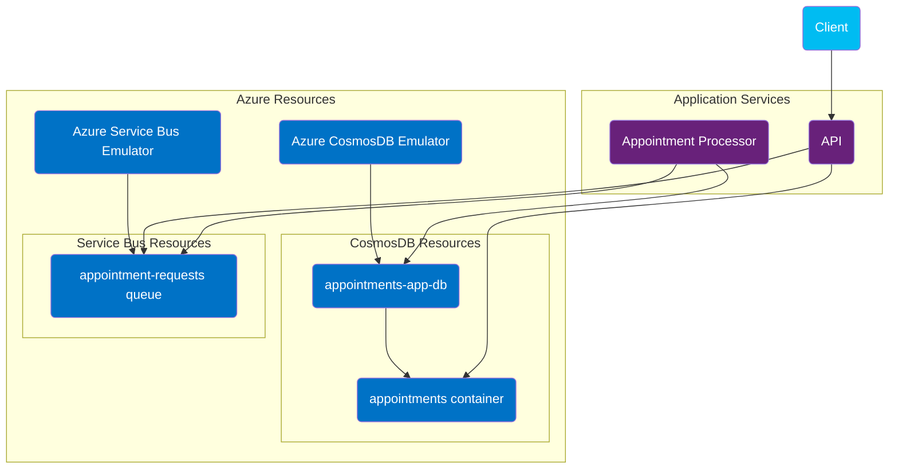

# Aspire Child Resource Integrations Demo

This repository demonstrates Aspire 9.2's child resource integrations via an appointment book app that takes a dependency on Azure Service Bus queues and Azure CosmosDB containers.

### Service Overview

